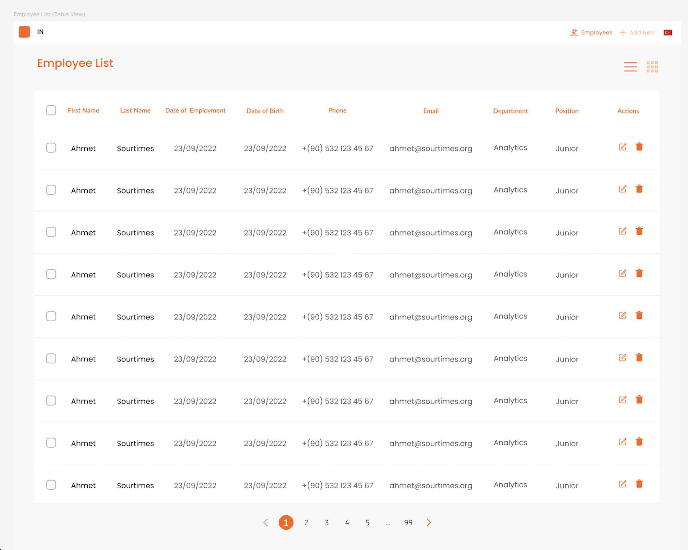

# GitHub Copilot Instructions for Employee Management Application

This document provides instructions and best practices for GitHub Copilot to assist in developing the Employee Management Application. The application is a fictional web app for HR staff to manage employee information.

The image below shows the final state of the application:



## Core Technologies & Key Constraints

- **Framework:** LitElement (JavaScript version only). Do NOT use TypeScript.
- **State Management:** Client-side state management is required to persist data in browser memory (e.g., using `localStorage` or `sessionStorage` for employee records). Implement `nanostores` third-party library. There is NO backend.
- **Routing:** A client-side router (e.g., Vaadin Router or any other suitable router) must be integrated for navigation.
- **Styling & Responsiveness:**
    - All components must be designed to be viewed flawlessly in both desktop and responsive modes.
    - **Crucially, no responsive CSS libraries (like Bootstrap, Tailwind CSS, etc.) are allowed.** Responsiveness must be achieved using custom CSS (e.g., Media Queries, Flexbox, CSS Grid).
- **Localization (i18n):**
    - Support for Turkish (tr) and English (en) languages is required.
    - The application must read the localization setting from the root `<html>` element's `lang` attribute.
- **Unit Testing:**
    - Detailed unit tests must be written for each web component and functionality created.
    - A test coverage ratio of at least 85% must be achieved.
- **Component Reusability:** Consider creating a single reusable web component for both creating and editing employee records.
- **User Prompts:** Prompt the user before updating or deleting an employee record.
- **Input Validation:** Implement appropriate validations for all input fields (format, uniqueness).

## 📁 Suggested Project Structure

A clear and maintainable folder structure is essential.

```
/src
  /components         # Individual LitElement web components
    /employee-list.js   # Component to display list/table of employees
    /employee-form.js   # Reusable component for adding/editing employees
    /confirm-dialog.js  # Confirmation dialog for delete/update actions
    /nav-menu.js        # Navigation menu component
    /ui/                # Smaller, generic UI elements (buttons, inputs if custom)
  /services           # For business logic, state management, localization
    /employee-service.js # CRUD operations, interacts with browser memory
    /localization-service.js # Handles language loading and translations
    /router.js          # Router configuration and instance
  /styles             # Global styles, CSS variables, responsive utility classes (custom)
    /global.css
    /responsive.css     # For custom responsive styles
  /localization       # Language files
    /en.json            # English translations
    /tr.json            # Turkish translations
/test                 # Unit tests
  /components/
    /employee-list.test.js
    /employee-form.test.js
    /confirm-dialog.test.js
    /nav-menu.test.js
  /services/
    /employee-service.test.js
    /localization-service.test.js
    /router.test.js
index.html            # Main HTML file (ensure `lang` attribute is present for localization)
index.js              # App entry point, router registration
```

📌 **Rules:**
- Keep components focused on a single responsibility.
- Prefer flat structures where sensible, but group related files (e.g., components, services, localization files).
- Use PNPM for package management.
- Use `import` statements for module imports, and ensure they are organized logically.

## ✨ LitElement (JavaScript) Best Practices

- **Properties & Events:** Use LitElement properties (`@property` or `static properties` in JS) for data input from parent to child. Use custom events (`this.dispatchEvent(new CustomEvent(...))`) for child-to-parent communication.
- **Reactive Updates:** Leverage LitElement's reactivity system for efficient DOM updates.
- **Scoped Styles:** Utilize LitElement's `static styles = css\`...\`;` for component-specific styling. This is default.
- **Lifecycle Methods:** Use lifecycle methods (`connectedCallback`, `updated`, `render`) appropriately.
- **JavaScript Syntax:** Adhere to modern JavaScript (ES6+) syntax. No TypeScript.
- **Render Functions:** Keep `render()` methods focused on templating. Delegate complex logic to other methods or services.

```javascript
// Example LitElement Component Structure
import { LitElement, html, css } from 'lit';
// import {
//   employeeService
// } from '../services/employee-service.js'; // Example service import

export class MyComponent extends LitElement {
  static styles = css`
    :host {
      display: block; /* Good default */
    }
    /* Add component-specific styles here */
  `;

  static properties = {
    myProp: { type: String },
    data: { type: Array },
  };

  constructor() {
    super();
    this.myProp = 'default value';
    this.data = [];
  }

  // connectedCallback() {
  //   super.connectedCallback();
  //   // Fetch initial data or setup listeners
  // }

  // firstUpdated() {
  //   // Called after the component's DOM has been rendered the first time
  // }

  _handleButtonClick() {
    this.dispatchEvent(new CustomEvent('my-event', { detail: { message: 'Hello from child' } }));
  }

  render() {
    return html`
      <p>${this.myProp}</p>
      <ul>
        ${this.data.map(item => html`<li>${item}</li>`)}
      </ul>
      <button @click="${this._handleButtonClick}">Click Me</button>
    `;
  }
}
customElements.define('my-component', MyComponent);
```

## 💾 State Management Best Practices (Client-Side)

- **Centralized Store (Recommended):** Whether custom or using a library, aim for a single source of truth for employee data.
- **Immutability:** When updating state, treat data as immutable to work well with LitElement's reactivity and simplify debugging.
- **Persistence:** Use `localStorage` or `sessionStorage` to save and retrieve the employee list, ensuring data persists in browser memory.
    - Load initial state from storage when the app starts.
    - Save state to storage after every modification (add, edit, delete).
- **Service Layer:** Abstract state interactions into a service (e.g., `employee-service.js`). Components should call service methods rather than directly manipulating the store or `localStorage`.
- **Uniqueness:** The `employee-service.js` should handle checks for uniqueness (e.g., unique email) before adding/updating records.

## 🛣️ Routing Best Practices

- **Clear Route Definitions:** Define routes in a dedicated `router.js` or similar. Map paths to specific components/views.
- **Programmatic Navigation:** Use the router's API for navigating after actions (e.g., after saving a form, navigate to list page).
- **Route Parameters:** Use route parameters for fetching specific records (e.g., `/employee/edit/:id` if you choose to implement ID-based routing for the reactive property).
- **Lazy Loading (Optional but good for performance):** If the router supports it, consider lazy-loading components for routes not immediately visible.

## 🎨 Styling & Responsive Design (Custom CSS)

- **CSS Custom Properties (Variables):** Use for themeable elements (colors, spacing) to maintain consistency.
- **Mobile-First Approach:** Design for small screens first, then add complexity for larger screens using media queries.
- **Flexbox & CSS Grid:** Leverage these for robust and flexible layouts.
- **Media Queries:** Define clear breakpoints for different screen sizes. Test thoroughly.
- **Avoid !important:** Use specificity or refactor CSS instead.
- **Global Styles:** Keep global styles minimal; prefer component-scoped styles. `global.css` can define base styles, fonts, and CSS variables.
- **No CSS Libraries:** Strictly avoid Bootstrap, Tailwind CSS, or any other responsive CSS libraries.

## 🌍 Localization (i18n) Best Practices

- **JSON Files:** Store translations in `.json` files per language (e.g., `src/localization/en.json`, `src/localization/tr.json`).
- **Localization Service:** Create a `localization-service.js` to:
    - Detect initial language from `document.documentElement.lang`.
    - Load the appropriate language JSON file.
    - Provide a function that components can call to get translated strings (e.g., `t('greetingKey')`).
- **Dynamic Content:** Ensure all user-facing text is passed through the translation function.
- **HTML `lang` Attribute:** Set `html[lang]` dynamically if you implement a language switcher (though the primary requirement is to *read* from it).

## 🧪 Unit Testing Best Practices

- **Testing Framework:** Use a suitable testing framework for LitElement (e.g., Web Test Runner with libraries like `@open-wc/testing`).
- **Component Tests:**
    - Test rendering output with different properties.
    - Test event emission and handling.
    - Test user interactions (clicks, form submissions).
    - Test reactive updates.
- **Service/Logic Tests:** Test utility functions and state management logic thoroughly.
- **Coverage:** Strive for >= 85% test coverage. Use coverage reporting tools.
- **Test Naming:** Use clear and descriptive names for tests.

## 🛠️ Development Workflow

- **Code Formatting & Linting:** Use ESLint (with Lit-specific plugins) and Prettier for consistent code style. Configure them to work well together.
- **Import Organization:** Keep imports organized:
  ```javascript
  // LitElement and related imports first
  import { LitElement, html, css } from 'lit';
  // import { property, customElement } from 'lit/decorators.js'; // Use if opting for decorators in JS context if needed

  // Project-specific services or components next
  // import { i18nService } from '../services/localization-service.js';
  // import './my-child-component.js';

  // Other utility imports
  ```
- **Comments:** Write clear comments for complex logic or non-obvious code sections.

## 🔥 Final Thoughts & Reminders

1.  **Adhere Strictly to LitElement JavaScript Version.**
2.  **No External CSS Libraries for Responsiveness.** This is a hard constraint.
3.  **Working Application is Paramount.**
4.  **Focus on Readability and Maintainability.**
5.  **Ensure all "Expected Behavior/Outcome" in the PRD table are met.**
6.  **Prioritize the 85% test coverage.**