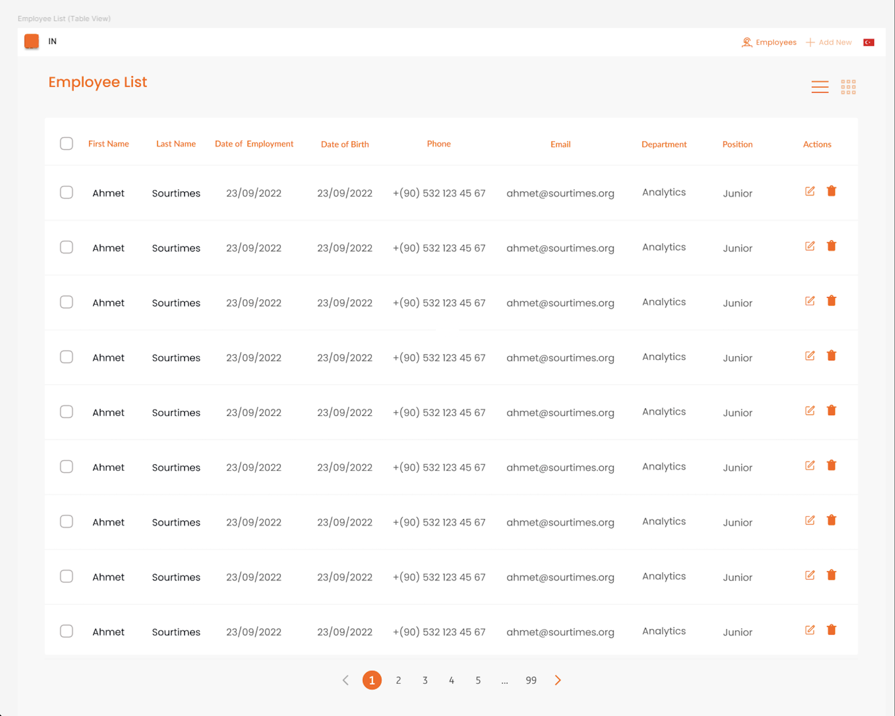

# Product Description
The Employee Management Application is a web-based tool designed to help HR staff manage employee records efficiently. Built using LitElement (JavaScript version), the application allows users to view, add, edit, and delete employee information in a user-friendly interface. It supports both list and table views, includes pagination and search functionality, and features a responsive design that works seamlessly across devices.
The application is fully functional, with a focus on client-side state management to persist data in the browser. It supports both Turkish and English languages, ensuring accessibility for a diverse user base. The project includes comprehensive unit tests to maintain code quality and ensure reliability.
The application is structured around reusable web components, allowing for easy maintenance and scalability. It utilizes a client-side router for navigation, ensuring a smooth user experience with unique URLs for different pages. The design adheres to modern web standards, providing a clean and intuitive interface for managing employee records.

Below is the design showing the finished version of the application:

## **Project Requirements: Employee Management Application**

The following table outlines the detailed functional requirements of the Employee Management Application.

| Requirement ID | Description                                                                                                | User Story                                                                                                                                                             | Expected Behavior/Outcome                                                                                                                                                                                                                           |
| :------------- | :--------------------------------------------------------------------------------------------------------- | :--------------------------------------------------------------------------------------------------------------------------------------------------------------------- | :-------------------------------------------------------------------------------------------------------------------------------------------------------------------------------------------------------------------------------------------------- |
| REQ001         | Application Core: Develop an employee management web application using LitElement JavaScript version.  | As an HR staff member, I want a web application built with LitElement (JavaScript) to manage employee information so that I can efficiently handle HR tasks.                   | A functional web application is developed using LitElement (JavaScript version) for HR staff to manage employee information.                                                                                                               |
| REQ002         | List View: Display employee records in two formats: list or table.  User selectable format.         | As an HR staff member, I want to view all employee records in either a list or a table format, and be able to choose my preferred view, so that I can easily access and understand employee data. | A web component displays employee records.  User can switch between a list view and a table view.                                                                                                                               |
| REQ003         | List View: Write the list titles in Title Case format.                                          | As the evaluator, I expect to receive a fully functional application that meets all the specified requirements for consideration.                                               | The final submitted project is a complete, operational web application that successfully implements all the requirements detailed in this document.
| REQ004         | List Functionality: Implement pagination and search for both list and table views.                        | As an HR staff member, I want to paginate through and search employee records in both list and table views so that I can quickly find specific employees and navigate large datasets efficiently. | Both list and table views include functional pagination controls and a search bar to filter records.                                                                                                                                     |
| REQ005         | Record Actions: Allow Edit and Delete operations for each record in the list/table view.                    | As an HR staff member, I want to be able to perform Edit and Delete operations directly on an employee's record from the list or table view for quick data management.                 | Each record displayed in the list or table view has "Edit" and "Delete" buttons enabling respective operations.                                                                                                                         |
| REQ006         | Add Employee - Component: Create a web component for adding a new employee record.                           | As an HR staff member, I want a dedicated component to add new employee records so that I can easily input new hire information into the system.                                      | A web component with a form is available for users to create new employee records.                                                                                                                                                   |
| REQ007         | Add Employee - Fields: Form to include First Name, Last Name, Date of Employment, DOB, Phone, Email, Department, Position.  | As an HR staff member, I want to input specific details for a new employee, including their first name, last name, date of employment, date of birth, phone number, email address, department (Analytics, Tech), and position (Junior, Medior, Senior).  | The "add employee" form includes input fields for all specified data points. Department and Position fields are pre-defined lists.                                                                                            |
| REQ008         | Add Employee - Validation: Implement input validation to prevent incorrect data and ensure uniqueness.      | As an HR staff member, I want the system to validate my input when adding an employee to ensure data accuracy (correct format) and prevent duplicate records (uniqueness).           | Input fields have client-side validation for format and required fields.  A mechanism checks for record uniqueness (e.g., email) against existing client-side data.                                                                    |
| REQ009         | Add Employee - Navigation: Navigate to employee list page after successful addition. [Page 2, after source 10]        | As an HR staff member, after successfully adding a new employee, I want to be automatically redirected to the employee list page to see the updated list of employees.                  | Upon successful submission of the "add employee" form, the application navigates the user to the employee list page. [Page 2, after source 10]                                                                                                        |
| REQ010         | Edit Employee - Component Access: Editable from list via "Edit" button; selected employee object as reactive input.  | As an HR staff member, I want to edit an existing employee's details by clicking an "Edit" button on their record, with their current information pre-filled in a form using a reactive property.  | Clicking the "Edit" button on a record in the employee list opens/navigates to an edit form.  The form is pre-populated with the selected employee's data, passed as a reactive input property.                                   |
| REQ011         | Edit Employee - Rules & Prompt: Same validation rules as "add"; prompt user before updating.         | As an HR staff member, I want the system to validate my input when editing an employee, following the same rules as adding a new one, and to ask for my confirmation before saving any changes. | The "edit employee" form implements the same input validation rules as the "add employee" form.  A confirmation dialog is shown to the user before the update operation is submitted.                                                  |
| REQ012         | Edit Employee - Navigation: Navigate to employee list page after successful update.                      | As an HR staff member, after successfully editing an employee's details, I want to be automatically redirected to the employee list page to see the updated information.               | Upon successful submission of the "edit employee" form, the application navigates the user to the employee list page.                                                                                                                     |
| REQ013         | Reusable Form Component: TIP - A single reusable web component can be created for both creating and editing.  | As a developer, I want to use a single, reusable web component for both adding and editing employee records to optimize development time and maintain consistency.                  | A single LitElement component is used for both "add new employee" and "edit existing employee" functionalities, adapting its state and behavior accordingly.                                                                           |
| REQ014         | Delete Employee Record: Remove selected record and update listing upon user confirmation.                | As an HR staff member, I want to delete an employee record, be prompted for confirmation before deletion, and see the employee list update immediately to reflect the removal.  | Clicking the "Delete" button on a record shows a confirmation prompt.  If confirmed, the selected record is removed from the application's state, and the employee list view updates automatically.                                 |
| REQ015         | Navigation Menu: Create a navigation menu web component for page navigation.                               | As a user, I want a clear navigation menu to easily switch between the different pages or sections of the application.                                                     | A web component serves as a navigation menu, allowing users to navigate between different application pages (e.g., Employee List, Add Employee).                                                                                        |
| REQ016         | Routing: Integrate a router (e.g., Vaadin Router or other) and configure routes.                       | As a user, I want to navigate the application using unique URLs for different pages and use browser back/forward buttons, facilitated by a client-side router.                     | The application uses a client-side router (e.g., Vaadin Router or a similar library) with appropriately configured routes for all navigable views.                                                                                |
| REQ017         | Responsive Design: Components/pages viewable on desktop and responsive modes flawlessly, without CSS libraries.  | As a user, I want the application to provide a seamless and flawless viewing experience on any device, whether it's a desktop, tablet, or mobile phone, achieved without using libraries like Bootstrap.  | All components and pages are designed to be fully responsive across various screen sizes using custom CSS (e.g., media queries, flexbox, grid) only.  No responsive CSS libraries like Bootstrap are used.                     |
| REQ018         | State Management: Implement client-side state management to persist data in browser memory (no backend).  | As a user, I want the employee data I manage to be persisted within the browser session  so that it's available even if I refresh the page, using a client-side state solution.     | Employee data is managed by a client-side state management mechanism (e.g., Redux, or a custom solution).  Data persists in browser memory (e.g., localStorage or sessionStorage).                                           |
| REQ019         | Localization: Support Turkish and English, reading language from html[lang] attribute.               | As a user, I want to be able to use the application in either Turkish or English, with the language automatically set based on my root HTML's lang attribute.             | All user-facing text in the application supports both Turkish and English.  The application detects and applies the language specified in the lang attribute of the root HTML element.                                      |
| REQ020         | Unit Tests: Detailed unit tests for each component and functionality, with >= 85% coverage.           | As a developer/stakeholder, I want comprehensive unit tests covering at least 85% of the codebase  to ensure code quality, maintainability, and catch regressions early.    | Each web component and significant piece of JavaScript logic has detailed unit tests.  The overall test coverage ratio is 85% or higher.                                                                                  |
| REQ021         | LitElement Version: Use LitElement's JavaScript version.  Starter project can be used.       | As a developer, I will use the JavaScript version of LitElement for creating the application, and I can utilize the official LitElement JavaScript starter project as a base. | The project is developed using LitElement with JavaScript, not TypeScript.  The LitElement JavaScript starter project may be used as a foundation.                                                                             |
| REQ022         | Working Application: Submission must be a working application.                                          | As the evaluator, I expect to receive a fully functional application that meets all the specified requirements for consideration.                                               | The final submitted project is a complete, operational web application that successfully implements all the requirements detailed in this document.